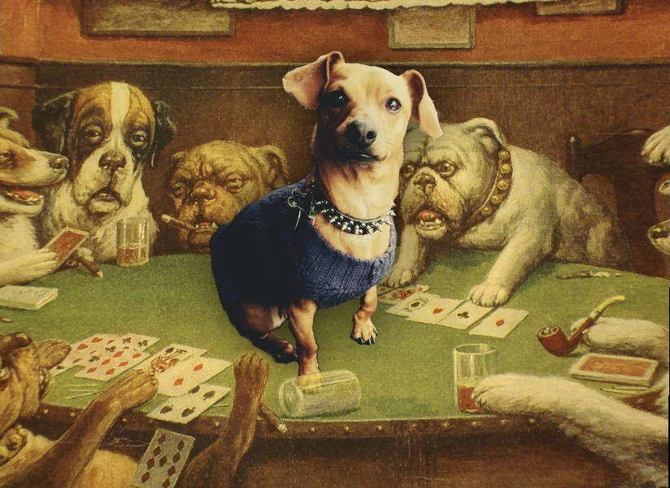

## Tonto's Card Game (Essex Programming Assignment)

-
Welcome to Tonto's Card Game! A simple card game dedicated to my girlfriend's lovely dog, Tonto. Have a sniff around!

### Install
Installing is a (dog) walk in the park. After pulling the repo down, `pip install` it:

`python3 -m pip install PATH/TO/REPO`

### Playing
To play the game, all you need is a few player names. Run `tonto NAME_1 NAME_2... NAME_3`
in your command line and it is off to the races.